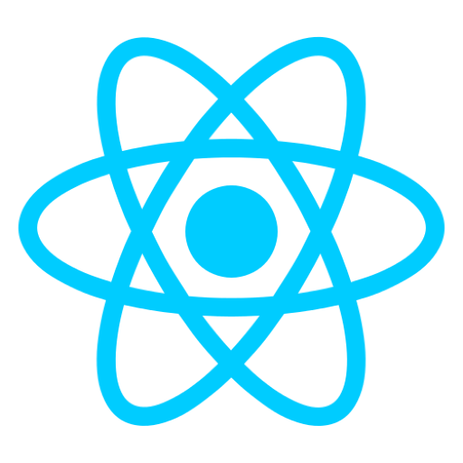

## Hi 👋 I'm Nayan, a Software Developer.
 

### My Languages and Tools:  

    &emsp;
    &emsp;
    &emsp;
    &emsp;
    
    &emsp;
    &emsp;
    &emsp;
    &emsp;

    

*Check out my [website](https://nayanpai.net)!*
